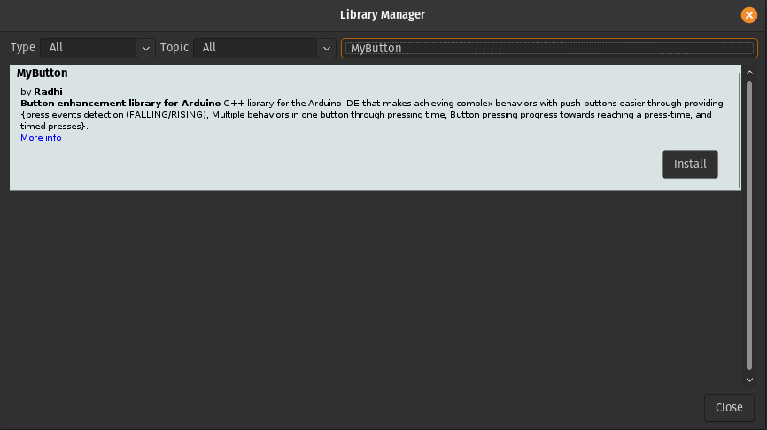
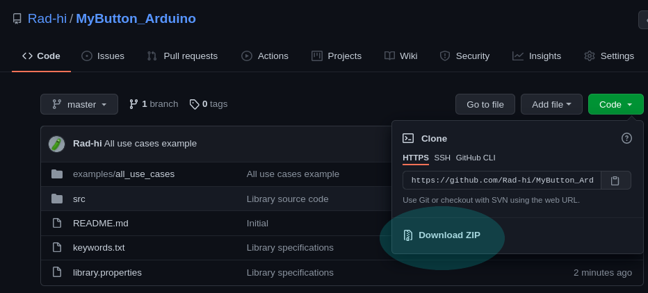

# MyButton Library for Arduino IDE


> Demo using the ```readInSteps``` function (check the SSD1306_multibutton example for code)

-<Read the documentation>-<brightgreen>>

## Making buttons easy and fun to work with

To discover what this library offers, read the docs: [https://mybutton-arduino.readthedocs.io/en/latest/index.html](https://mybutton-arduino.readthedocs.io/en/latest/index.html).

## How to install ?

### 1 - Through the Arduino Library manager:

Go to **tools -> Manage Libraries... -> Type MyButton** and as shown in the picture below, you'll find the MyButton library.



### 2 - Direct download/import: 



Click on **Download ZIP** to download the library, place the unzipped folder into your libraries folder in your **arduinosketchfolder/libraries/PUT_HERE**(on Windows, this is likely to be under **Documents/Arduino/libraries**, on linux this is under **home/Arduino/libraries**). You may need to create the libraries subfolder if its your first library. Now, restart the IDE.

## Change LOG

### v1.2.0 (22th January, 2022)

- Created **MyCountingButton** library, didn't test it thoroughly though, just made sure that all functionalities work as intended.
- Created a documentation on [readthedocs.org](https://readthedocs.org/), which is present under the ```docs/``` folder.
- Updated this readme.
- TODO: Examples for the **MyCountingButton** library. 

### v1.1.0 (24th August, 2021)

- The major change is that, there were some compatibility issues with Arduino, and now the examples work with **both the Arduino UNO, and the ESP32** (Only tested on an **UNO** and an **ESP32**, gonna try to test on an **ESP8266** soon).

### v1.0.2 (24th August, 2021):

- Added debouncing to ```readInSteps()``` and made it return a **ABORTED_STEPS** value when the user stops pressing in the middle of the pressing period without reaching the intended stepped-period.
- Updated the Display API (wrapper class to the Adafruit_SSD1306 library) to make it more efficient and more intuitive, no change in how it works though.
- Grouped the state variables used for all functions into a single ```uint8_t flag``` saving with this 3 bytes of memory.
- Added multiple buttons driven animations example.

### v1.0.1 (22nd August, 2021):

The ```readRisingClick()``` was repeatedly reporting a "rising edge" detection as long as the button was pressed, so fixed that, and now it's reporting only the detection of the rising edge, as it's supposed to do.
