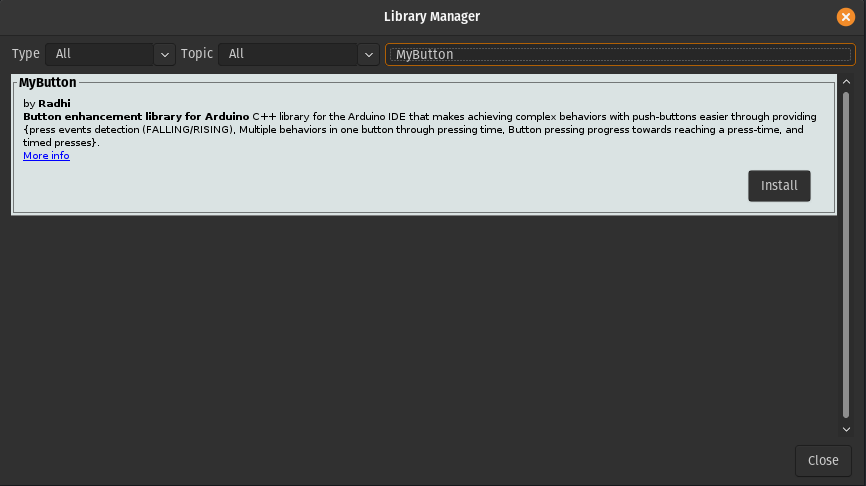

=========================================
Getting started with **MyButton** library
=========================================

MyButton was originally created to make interacting with push-buttons easier for makers of interactive embedded projects. Down the line, it was extended with a second library **MyCountingButton**, which is dedicated for counting presses and interactions that are linked with counting presses in general.

If you have a project that has push-botton(s) in it, or are thinking of one, and would like to make the interactions with this project a bit more polished and complex, whilst not having to deal with the problems that arise from working with push-buttons, such as bouncing, then MyButton was made for you!

Check the source code from here: https://github.com/Rad-hi/MyButton_Arduino

1. How to install ?
----------------

1.1. Through the Arduino Library manager:
++++++++++++++++++++++++++++++++++++++++

Go to **tools -> Manage Libraries... ->** type **MyButton** and as shown in the picture below, you'll find the MyButton library.

1.2. Direct download/import: 
+++++++++++++++++++++++++++

.. image:: ../../images/download.png
   :width: 640
   :alt: How to install through a direct download (ZIP).

Click on **Download ZIP** to download the library, place the unzipped folder into your libraries folder in your **arduinosketchfolder/libraries/PUT_HERE**(on Windows, this is likely to be under **Documents/Arduino/libraries**, on linux this is under **home/Arduino/libraries**). You may need to create the libraries subfolder if its your first library. Now, restart the IDE.

2. What's next?
------------
For individual documentations for each of the libraries (methods, how to use, objects, code examples, ...), Go to the MyButton/MyCountingButton pages.
